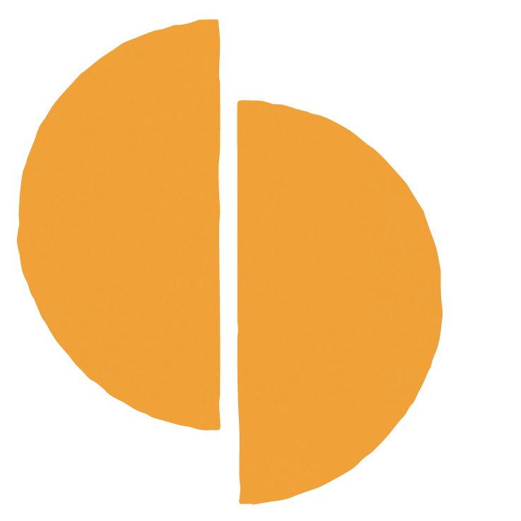

# LIF Brand Kit

Everything needed to design LIF surfaces. Drop this whole folder into a new board.

```
brand-kit/
├── BRAND.md              ← this file: colors, type, texture rules
├── lif.css               ← @font-face + CSS variables + texture classes
├── fonts/                ← Romana BT (2), Apercu (3)
├── logos/                ← wordmark + mark in 5 colorways
└── textures/             ← 3 colour textures + light paper + word crops
```

---

## Colour

Exact values. Never substitute, tint or approximate.

| Name | Hex | Use |
| --- | --- | --- |
| Air | `#FDFCF8` | The sole background for LIF screens and emails |
| Not Black | `#2F2B2B` | Type and rules only. Never a background fill |
| Warm Sol | `#F3A43A` | The LIF mark and standard actions |
| Poppy | `#CA0000` | The heart and the funded LOVE IT FORWARD action |
| Texture Red | `#EE3339` | Base pigment under the red texture |
| Texture Yellow | `#FFB610` | Base pigment under the yellow texture |
| Texture Blue | `#0071A5` | Base pigment under the blue texture |
| White | `#FFFFFF` | Type on red and blue textures only |

Shell (`#F9EFE5`) is retired as a background.

One saturated action per composition. No gradients, no tints stacked, no dark presentation screens.

---

## Typography

**Romana BT** — headings and standalone emphasis statements. Never body copy.
**Apercu Regular / Bold** — body copy, labels, actions, all interface chrome.
**Apercu Light** — large ledes only.

Georgia and Arial are technical fallbacks for email. Nothing else.

| Role | Setting |
| --- | --- |
| Section heading | Romana 42px / 1.02, letter-spacing −0.01em |
| Display statement | Romana 62–104px / 0.98, letter-spacing −0.02em |
| Textured headline | Romana 46–76px / **1.5** (the extra leading is what stops the backing clipping) |
| Lede | Apercu Light 300, 15–22px / 1.55 |
| Body | Apercu Regular 400, 15–17px / 1.5 |
| Label / eyebrow | Apercu Bold 700, 11px, letter-spacing 0.18em, uppercase |
| Action label | Apercu Bold 700, 13–14px, letter-spacing 0.14em, uppercase |

Sentence case for body and headings. All caps only for eyebrows, labels, actions and the wordmark. Never title case.

Put `text-wrap: balance` on every display line. Avoid hardcoded `<br>`. Let sentences stay one element and wrap naturally.

---

## Logos

Use the **mark and wordmark side by side as one lockup**. Mark in Warm Sol, wordmark in Not Black. Never typeset "LIF" as a substitute.

```html
<div style="display:flex;align-items:center;gap:7px">
  
  
</div>
```

Gap is roughly 23% of mark width. Wordmark cap height sits at ~70% of mark height.

The other mark colorways (black, poppy, blue, palm) are for favicons and app icons, as a family. Never as a UI element.

---

## Texture system

Four scanned paper files. They are photographic source of truth — do not substitute solid colours, CSS gradients or generated grain.

| File | Original | Kit file | Use |
| --- | --- | --- | --- |
| Red | 3500×2500 | `textures/lif-texture-red.jpg` | The act of giving. Statement pages, the GIVER highlight |
| Yellow | 3500×2500 | `textures/lif-texture-yellow.jpg` | The default highlight. The person and the feeling |
| Blue | 3500×2500 | `textures/lif-texture-blue.jpg` | Proof and plain fact. Used sparingly |
| Light paper | 736×1104 | `textures/lif-texture-paper.jpg` | The quiet ground under Air |

`*-word.jpg` files are 900×300 centre crops for headline-word backings — smaller payload, same grain at word scale.

### Textured headline words

One word per heading. White (or charcoal on yellow) uppercase Romana on a tight rectangle of texture. Surrounding words keep the normal heading treatment and the same size.

```html
<p style="font:400 76px/1.5 'Romana BT',serif;letter-spacing:-0.01em;text-wrap:balance">It
  <span style="display:inline;background:url(textures/lif-texture-red-word.jpg) center/cover;
    color:#FFFFFF;text-transform:uppercase;padding:.30em .18em .32em;
    -webkit-box-decoration-break:clone;box-decoration-break:clone;
    white-space:nowrap">happens</span>.</p>
```

Locked values, matching the HAPPENS reference:

- `display: inline` — never inline-block, which breaks baseline alignment
- padding `.30em .18em .32em` — the asymmetry optically centres the caps
- `line-height: 1.5` on the parent, so the backing never clips the line above
- `white-space: nowrap` and `box-decoration-break: clone` — the word never splits and punctuation stays outside the backing
- background `center/cover`

Apply to headings and standalone emphasis statements. Never to a word inside an Apercu body paragraph. Never a whole sentence.

### Approved examples

| Statement | Highlight | Ink |
| --- | --- | --- |
| SOMEONE comes to mind. | yellow | `#2F2B2B` |
| The TRUST gets there first. | yellow | `#2F2B2B` |
| The receiver becomes the GIVER. | red | `#FFFFFF` |
| LIF is REAL. | blue | `#FFFFFF` |

White type fails on yellow. Charcoal is the approved ink for the yellow backing, in both word and full-page use.

### Full textured backgrounds

Selected statement pages only. Texture and text stay on separate layers; the type is never faded to make a texture read.

| Texture | Text | Signature | Layer setting |
| --- | --- | --- | --- |
| Red `#EE3339` | `#FFFFFF` | `rgba(255,255,255,.85)` | texture 100%, no overlay |
| Blue `#0071A5` | `#FFFFFF` | `rgba(255,255,255,.85)` | texture 100%, no overlay |
| Yellow `#FFB610` | `#2F2B2B` | `rgba(47,43,43,.7)` | texture 100%, no overlay |

Where a texture is loud enough to fight the type, lower the **texture layer** to 90% over the flat base pigment. Never reduce text opacity. Padding 64px 40px minimum.

On a full textured page, use typography for emphasis. Do not add another textured rectangle behind a word.

### Usage across formats

**Web** — one textured statement per scroll. Full textured sections as punctuation between Air sections.
**Presentations** — full textured statement slides between Air content slides. One highlighted word per title.
**Demo opening screens** — a single full textured frame carrying the promise, then Air for everything functional.
**Product screens** — selectively. Forms, checkout and activity data stay on Air so they remain easy to use.

---

## Voice

Clean. Short. Cool. Direct. Warm without sentimentality.

One thought per screen. Person and reason before the amount. No em dashes in customer-facing copy. Every visible sentence complete. Never tell customers what they should feel.

Signature: **Have love. Will share.** Once, at the foot of every LIF-owned surface and email. Never on a merchant surface, never as a headline or CTA.
